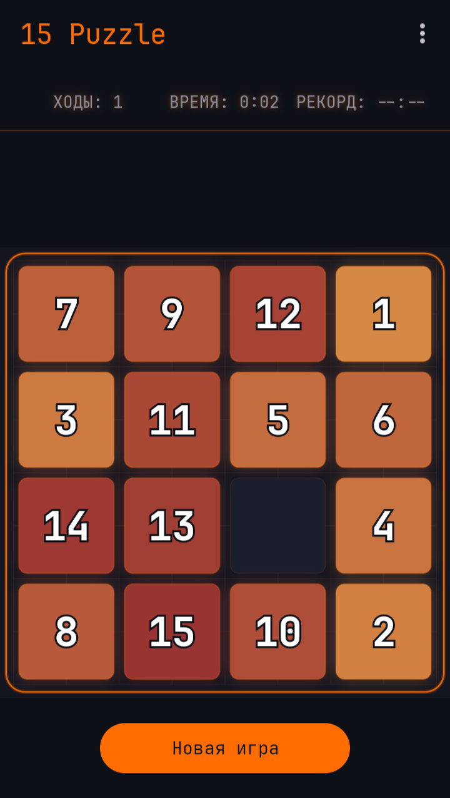

# 15 Puzzle

A sliding-tile puzzle game for Android, written in Java.

Slide the numbered tiles into the empty slot to arrange them in order from 1 to 15. Choose your difficulty, beat your best time, and track your statistics.



## Features

- **Multiple difficulties** — 3×3 (8-puzzle), 4×4 (15-puzzle) and 5×5 (24-puzzle)
- **Three color themes** — Yellow & Green, Orange & Red, Rose & Purple
- **Timer & best times** — per-difficulty best times persisted on the device
- **Move counter** and a **win dialog** with your time and move count
- **Two input modes** — tap a tile or swipe to slide it, with smooth slide animations and a comet-tail trail
- **Win celebration** — particle burst and shockwave effect on solving
- **Statistics** — games played, games won, total moves and best times (with reset)
- **Haptic & sound feedback** — optional, toggleable in Settings
- **Game resume** — the in-progress game survives rotation and process death
- **Dark neon design** — custom font, glow effects and a cohesive color scheme
- **Localized** — English and Russian
- **No permissions, no ads, no analytics** — fully offline

## Tech stack

- Language: **Java 11**
- UI: **Material 3** (`Theme.Material3.Dark`) + custom `PuzzleView` (Canvas rendering)
- Architecture: **MVVM** — `AndroidViewModel` + `LiveData`
- Persistence: `SharedPreferences` via a `GameRepository`
- Font: [JetBrains Mono](https://www.jetbrains.com/lp/mono/) (SIL Open Font License)

## Requirements

- JDK 17+ (JDK 25 is also fine)
- Android SDK — `compileSdk` 37, `minSdk` 24, `targetSdk` 37
- Gradle 9.5 (wrapper included)

## Building

```bash
# Debug APK (auto-signed with the debug key)
./gradlew :app:assembleDebug
# -> app/build/outputs/apk/debug/app-debug.apk

# Release APK (minified with R8 + resource shrinking)
./gradlew :app:assembleRelease
# -> app/build/outputs/apk/release/app-release.apk
```

### Release signing

The release build reads credentials from a `keystore.properties` file at the
project root (see `keystore.properties.example`). If that file is absent, the
release build falls back to the debug key so it can still be built locally.

```properties
storeFile=/path/to/your/release.keystore
storePassword=your_store_password
keyAlias=your_key_alias
keyPassword=your_key_password
```

Generate a keystore once and keep it safe:

```bash
keytool -genkey -v -keystore release.keystore -alias 15puzzle \
        -keyalg RSA -keysize 2048 -validity 10000
```

> `local.properties` (SDK path) and `keystore.properties` are git-ignored and
> must be recreated on each machine.

## Testing

```bash
./gradlew :app:testDebugUnitTest   # unit tests (board logic, solvability, moves)
./gradlew :app:lint               # static analysis
```

## Project structure

```
app/src/main/java/com/example/puzzlegame/
├── game/      Board, Difficulty, Direction, Move, TileTheme, GameViewModel, SoundManager
├── data/      GameRepository, SavedGame
└── ui/        MainActivity, PuzzleView, SettingsActivity, SingleLiveEvent
```

## Continuous integration

A GitHub Actions workflow (`.github/workflows/android.yml`) builds the debug
APK and runs the unit tests on every push and pull request.

## Localization

- English (`values/strings.xml`)
- Russian (`values-ru/strings.xml`)

## License

The app is licensed under the MIT License. The bundled **JetBrains Mono** font is licensed
under the [SIL Open Font License, Version 1.1](licenses/JetBrainsMono-OFL.txt), which
permits free commercial use.
